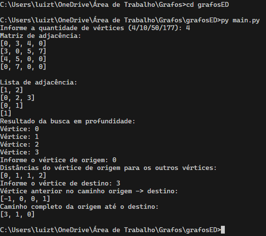

# Grafo implementação do BFS e DFS

## 📄 Descrição

Implementação da estrutura de dados grafo em python e dos algoritmos de busca em largura (BFS) e busca em profundidade (DFS).

---

## 🗂️ Estrutura
 ```bash
📦 Grafos
├─📂 grafosED
├── 📂 **pycache**
├── 📂 input
│ ├── pcv4.txt
│ ├── pcv10.txt
│ ├── pcv50.txt
│ └── pcv177.txt
├── grafos.py
├── lerArquivo.py
├── main.py
└── README.md
```
---

## ⚙️ Execução do código

```
cd grafosED

py main.py
```

---

## 🖥️ Simulação



## Luiz Filipe Santos de Souza
